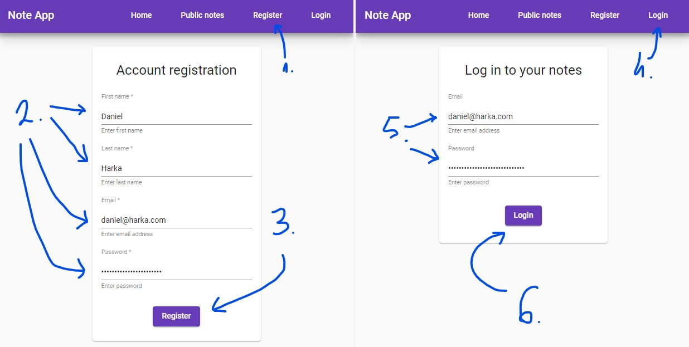
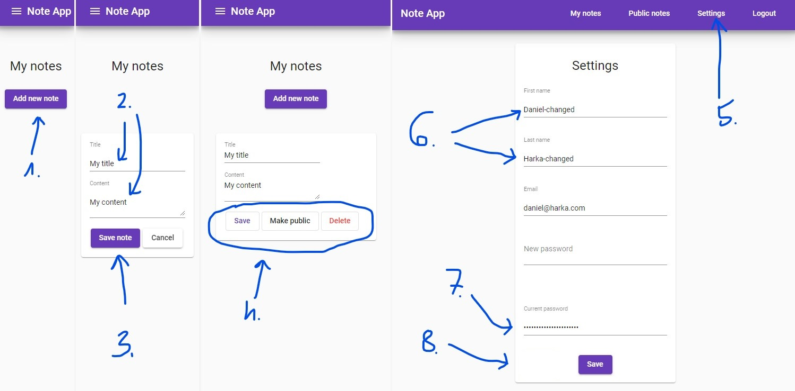
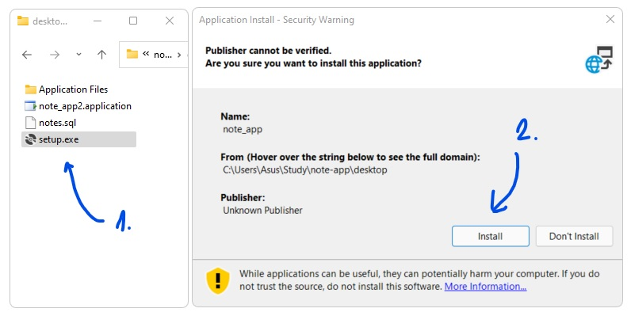
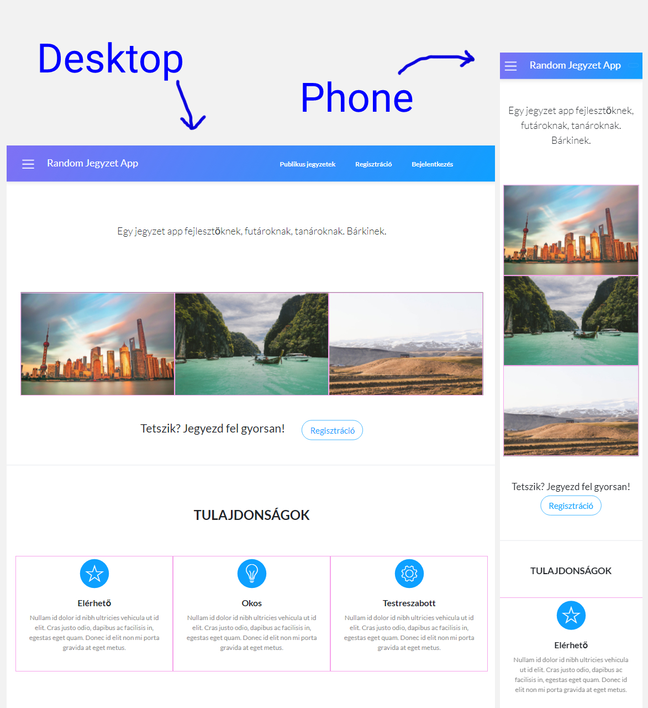
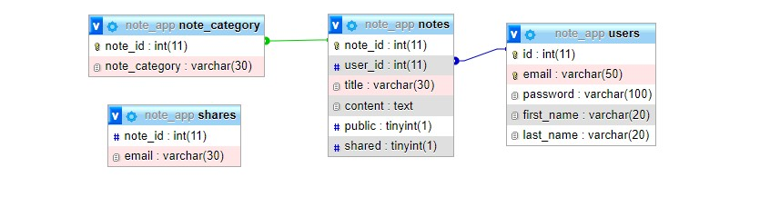
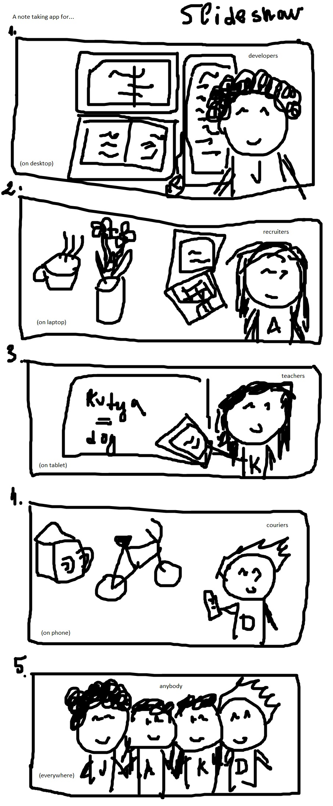
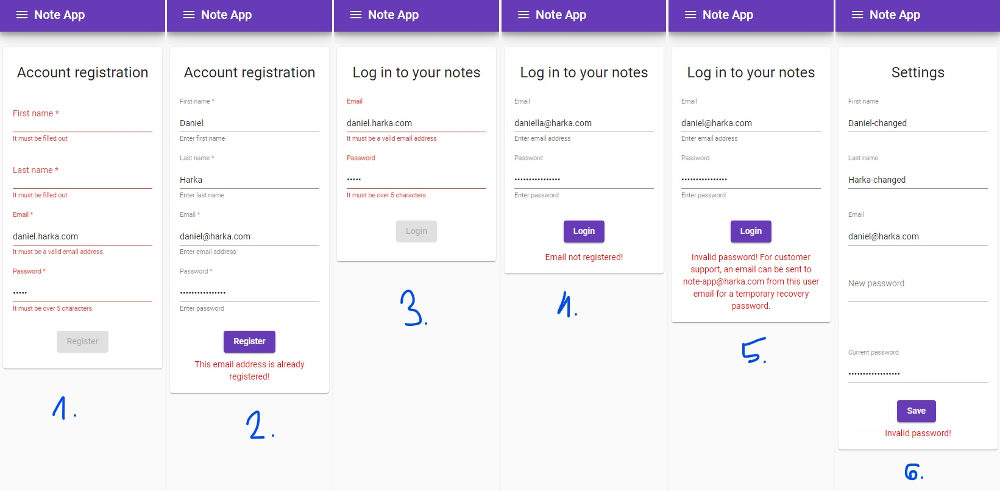

# Note App - Documentation <a id="top"></a>

This is the documentation of the Note App.

## Table of contents

- [What is this?](#what-is-this)
  - [Introduction](#introduction)
  - [Tech stack](#tech-stack)
- [Who created it?](#who-created)
- [What are the features?](#features)
- [How to use it?](#how-to-use)
  - [Using the web app](#using-web-app)
  - [Using the desktop app](#using-desktop-app)
- [How to build/deploy/test it?](#building)
  - [Web app source](#web-source)
  - [Desktop app source](#desktop-source)
- [How was it developed?](#how-developed)
  - [Brainstorming](#brainstorming)
  - [Teamwork](#teamwork)
  - [Wireframe](#wireframe)
  - [Git(Hub)](#git)
  - [Database](#database)
  - [Frontend](#frontend)
  - [Backend](#backend)
  - [Desktop](#desktop)
- [How was it tested?](#testing)
  - [Web app testing](#web-testing)
  - [Desktop app testing](#desktop-testing)
- [What are the limitations?](#limitations)
- [Which are the future plans?](#future-plans)
- [What are the self-assessments?](#self-assessments)
- [How to collaborate?](#collaboration)
- [Why was it needed?](#why-needed)
- [Where was it created?](#where-created)
- [When was it developed?](#when-developed)
- [Who helped?](#who-helped)
- [What were the resources?](#resources)

## What is this? <a id="what-is-this"></a>

Here is some basic information about the project.

Random labels: Rest API, CRUD app, HTTP, JavaScript, TypeScript, Angular, requests, promises, observable, responsive, C#

### Introduction <a id="introduction"></a>

This is simple note taking app, for developers, recruiters, teachers, couriers and basically anyone, who would like to take quick notes.

### Tech stack <a id="tech-stack"></a>

**Database**

For the database a MySQL database of the MariaDB type is used, which is running on phpMyAdmin.

**Frontend**

For the frontend the Angular framework is used. It's a development platform, which is built on TypeScript.

**Backend**

For the backend Node.js is used, which is a JavaScript runtime built on Chrome's V8 JavaScript engine.

**Desktop**

For the Desktop C# is used. It's an object-oriented and type-safe programming language.

[Top ↑](#top)

## Who created it? <a id="who-created"></a>

These are the developers and maintainers of the project:

- Jozsef Biro ([https://github.com/bjozsef02](https://github.com/bjozsef02))
- Daniel Harka ([https://github.com/MrDanielHarka](https://github.com/MrDanielHarka))

The C# and database part of this documentation was written by Jozsef, the frontend and backend part was written by Daniel. All the rest was written together.

[Top ↑](#top)

## What are the features? <a id="features"></a>

Anybody, even unregistered users can see the public notes which are taken by registered users. When a user logs in then they have the opportunity to take notes of their own. They can also change or delete their notes later on if they wish to. Notes can be toggled to public, so those can be read by anybody who are using the app. Users are also able to change their settings in the applications.

Moreover, in the desktop application, users can share their notes to specific people, by providing an email address. If the admins log in, they can also perform the aforementioned functions, in addition to seeing various statistics about users, without violating their private data.

[Top ↑](#top)

## How to use it? <a id="how-to-use"></a>

### Using the web app <a id="using-web-app"></a>

**Registration and logging in**

1. Click on the `Register` link.
2. Fill in your details.
3. Click the `Register` button.
4. Click the `Login` link.
5. Fill in your details.
6. Click the `Login` button.



**Note taking and changing settings**

1. Click the `Add new note` button for adding a new note.
2. Fill in the note details.
3. Click the `Save note` button.
4. You can edit your note, then click the `Save` button again. You can also toggle your note to public or delete it by using the dedicated buttons.
5. Click the `Settings` link to change your settings.
6. Change your desired details.
7. Fill in your current password.
8. Click the `Save` button.



**Hardware & software requirements**

- Internet connection.
- JavaScript capable web browser.

[Top ↑](#top)

### Using the desktop app <a id="using-desktop-app"></a>

**Installation**

The desktop application will be available for download from a link in the web application that will lead to an online storage. There will be three files in the repository. The files cannot be modified by the user. The user have to double click to the the setup file to download it. After installation, the program will be available on your computer as an desktop application.



First run `setup.exe` then click the `Install` button.

[Top ↑](#top)

**Usage**

The user must log in first or register if they are not already registered. The password is encrypted in the database during registration. Password encryption works “back and forth” between the web application and the desktop. After logging in your can check your notes, the publical notes and the shared notes which you get from other people. All these three categories of notes will apper in three different tables.

Your own notes table have a four buttons column the first button is tell yout is it publical or not. If it is not a publical note the button text is private if it is publical the button text is publical, if the button text is publical and you press it you can make it private, if it is private and you press it you can make it publical.

The second button is the share button, the share button text private if it is not a shared note, if the button text is shared the note is shared with atleast one person.If the button text is private and you press it you can share it if you know his email address , if the button text is shared you still can share with some else buti f you want you also can make it private. It is also possible to unshare a note with someone.

The third button is the save as button with this button you can save your note in your pc or laptop.

The fourth button is the delete button with this button you can delete your note.

[Top ↑](#top)

**Operating System**

Windows 10 or later.

**Hardware requirements**

1.8 GHz or faster processor

Minimum 2 GB RAM

Hard disk space: at least 800 MB

A video card that supports a minimum display resolution of 720p (1280 x 720).

[Top ↑](#top)

## How to build/deploy/test it? <a id="building"></a>

### Web app source <a id="web-source"></a>

The source code can be either forked, cloned or downloaded as a zip file.

The frontend part can be run with `ng serve` if the Angular CLI is present on the system.

The backend part can be run with `node app.js`, `nodemon app.js` or `heroku local web`.

A database needs to be connected to the app in order for it to work properly. It can be a local one, but it can also be on an online server.

### Desktop app source <a id="desktop-source"></a>

The application's source can be downloaded from GitHub, then the testing can begin right away. A working database is also needed, to be able to test the app locally.

[Top ↑](#top)

## How was it developed? <a id="how-developed"></a>

Here are some details of the desktop and the web app development.

[Top ↑](#top)

### Brainstorming

It was a completely random idea. A project was needed and since Jozsef and Daniel did not have any specific ideas, they just picked a topic which they thought they could learn the most from. Hence the choice was a note taking app, which is somewhat similar to Google Keep, but simpler and more minimalistic.

The idea was that users can save notes after logging in. They can of course edit them. When that's done, then they wanted users to be able to make the notes public, so everybody can see them. After all that is done and there is still time left, then they wanted to enable users to share notes between eachother.

### Teamwork

Jozsef and Daniel assigned the tasks between each other. Jozsef took responsibility for the desktop app and the database creating, while Daniel was doing the web app's frontend and backend part.

They communicated over Microsoft Teams, Discord, Facebook/Messenger, email, phone and in person when they had the opportunity to meet and shared documents over Git/GitHub and Microsoft Onedrive.

Plans were made in Microsoft Lists and Google Sheets and those were followed more or less, to be able to finish the project on time. Jozsef and Daniel are both hard working, so completing the tasks in time did not seem to be a problem, even though they did encounter quite a few challenges and difficulties.

[Top ↑](#top)

### Wireframe

Sorry, the initial wireframes were made in Hungarian, but hopefully you get the idea. This was just a quick example how the app might look like.



[Top ↑](#top)

### Git(Hub) <a id="git"></a>

Something was needed for collaboration and version control. Git was the obvious best choice to start with, because it is perfect for both use cases. Jozsef and Daniel wanted to learn and use a tool, which will be useful for them in the future as well, when they are working as developers.

They also needed a platform where they could publish their work using Git. Bitbucket and GitLab were also considered, but they went for GitHub in the end, for it being the most used and most documentation is available for that platform.

Then the Note App repository was born and they have collaborated in that, since the very beginning of the project. Jozsef and Daniel both did the coding on their own computers. The code was committed and uploaded to GitHub regularly using Git, after changes were made to the source.

[Top ↑](#top)

### Database

The data of the web and desktop app needed to be stored somewhere, so a database was needed.

After spending way to much time on searching for a free database provider, finally the ClearDB service was found. It offers 5MBs of free storage for Heroku users.

There are four tables in the database.



**`users` table**

- id: Unique value of the user, it is automaticly generated. This is a primary key in this table.

- email: It is an unique key.

- password: It is an varchar type field which can be 100 characters. This have to be that long because of encryption.

- The first_name and the last_name are just a basic text type field.

**`notes` table**

- note_id: unique value of the note, it is automaticly generated. This is a primary key in this table.

- user_id: This is the id from the users tablet that is why it has a realationship with the id in this table this is an unique key.

- title: This field is an varchar field which is cointein maximum 30 character.

- content: This is an text field which is for the content for the notes it maximum contain 65535 characters.

- The public and the shared field are a boolean type filed it can be 0 or 1. It is 0 if it is not true, 1 if it is true.

**`note_category` table**

- note_id: unique value of the note, it is automaticly generated. This is a primary key in this table. It has an relationship with the note_id field in the notes table.

- note_category: this an varchar field, with maximum of 30 characters.

**`shares` table**

- note_id: This is an int field which is contain the unique value of the note which is shared.

- email: This is a varchar field which is cointain the the email address of the user you want to share with.

[Top ↑](#top)

### Frontend

The frontend of the web app could be made with HTML5, CSS3 and vanilla JavaScript, but to be able to create something that is complex and can be scaled later on, Angular was chosen.

Coding in Angular is by using TypeScript, which is a superset of JavaScript. It helps developers by letting them assign types to variables and there is also strict error checking, so there would be less errors during runtime and errors are caught on compilation.

Angular applications are built with components and this complex app is also built by quite a few of them. You can have an insight of the folder and file structure which can be seen below.

```
app/
├─ components/
│  ├─ home/
│  ├─ login/
│  ├─ menu/
│  ├─ note/
│  ├─ public/
│  ├─ register/
│  ├─ settings/
│  ├─ welcome/
│  │  ├─ welcome.component.css
│  │  ├─ welcome.component.html
│  │  ├─ welcome.component.ts
```

Components are TypeScript classes which determine, how that specific part or building block of the application will behave and function. View (HTML) and style (CSS) can also be assigned to components either inline or externally. Those determine the structure and customization of the components.

Let's take a look at the **note component**, to get some basic understanding of how components work.

```typescript
// These are the imports that are needed for the service to work properly.

import { Component, OnInit } from '@angular/core';
import { Router } from '@angular/router';
import { UserNote } from 'src/app/models/UserNote';
import { NoteService } from 'src/app/services/note.service';
import { UserService } from 'src/app/services/user.service';

// These are the component details.

@Component({
  selector: 'app-note', // This is how the component is accessed.
  templateUrl: './note.component.html', // This is the component's view.
  styleUrls: ['./note.components.css'], // This is the component's style.
})

// This part determined the logic of the component.
export class NoteComponent implements OnInit {
  public userNotes: any;
  isCreatingNewNote = false;
  isPublic(booleanInteger: number) {
    if (booleanInteger === 1) {
      return 'Make private';
    } else {
      return 'Make public';
    }
  }

  // This is the structure of a new note.

  newNote: UserNote = {
    noteId: 0,
    userId: this.userService.userId,
    title: '',
    content: '',
    isPublic: 0,
  };

  // This is the structure of an updated note.

  updateNote: UserNote = {
    noteId: 0,
    userId: this.userService.userId,
    title: '',
    content: '',
    isPublic: 1,
  };

  // The used dependencies are put in the constructor, so no instantiation is needed and our component can use the services.

  constructor(
    public userService: UserService,
    private noteService: NoteService,
    private router: Router
  ) {}

  // This part is needed to get the user notes from the backend.

  getUserNotes() {
    this.noteService.onGetUserNotes(this.userService).subscribe((response) => {
      this.userNotes = response;
      // console.log(this.userNotes);
    });
  }

  // This code runs, when a new note is created.

  onFormSubmit(event: any) {
    event.preventDefault();
    this.onNewNote();
  }

  onNewNote() {
    console.log('Note added.');
    this.noteService.onNoteAdded(this.newNote).subscribe((response) => {
      // this.userNotes = response;
    });
    setTimeout(() => {
      this.newNote.title = '';
      this.newNote.content = '';
      this.getUserNotes();
      this.isCreatingNewNote = false;
    }, 500);
  }

  // This code runs, when a note is edited.

  onUpdateNote(noteIndex: number) {
    console.log(noteIndex);
    console.log(this.userNotes);
    console.log(this.userNotes[noteIndex]);
    this.noteService.onUpdateNote(this.userNotes[noteIndex]);
  }

  // This code runs, when the note's public status is toggled.

  onToggleSharing(noteIndex: number) {
    if (this.userNotes[noteIndex].public === 1) {
      this.userNotes[noteIndex].public = 0;
    } else {
      this.userNotes[noteIndex].public = 1;
    }
    this.noteService.onUpdateNote(this.userNotes[noteIndex]);
  }

  // This code runs, when a note is deleted.

  onDeleteNote(noteIndex: number) {
    this.noteService.onDeleteNote(this.userNotes[noteIndex]);
    // this.getUserNotes();
    setTimeout(() => {
      this.ngOnInit();
    }, 500);
  }

  // This code runs once, when our component loads.

  ngOnInit(): void {
    this.getUserNotes();
    this.isCreatingNewNote = false;
  }
}
```

Services are special type of components, that are widely available within the application and are accessible by all of the components. Those usually contain shared information and logic, that multiple components need and rely on to be able to function correctly.

The following are the ones used in this application:

```
services/
├─ login.service.ts
├─ note.service.ts
├─ public.service.ts
├─ settings.service.ts
├─ url.service.ts
├─ user.service.ts
```

Let's take a look at the **note service**, to get some basic understanding of how services work.

```typescript
// These are the imports that are needed for the service to work properly.

import { HttpClient } from '@angular/common/http';
import { Injectable } from '@angular/core';
import { User } from '../models/User';
import { UserNote } from '../models/UserNote';
import { UrlService } from './url.service';

// We declare it an injectable, which means other parts of the app can use it.
@Injectable({
  providedIn: 'root',
})

// The class is exported, so other components can use it.
export class NoteService {
  constructor(private httpClient: HttpClient, private urlService: UrlService) {}

  // This part gets the user notes, that are already in the database.

  public onGetUserNotes(user: User) {
    return this.httpClient.post(
      `${this.urlService.serverUrl}/user-notes`,
      user,
      {
        headers: { 'content-type': 'application/json' },
      }
    );
  }

  // This code runs when a new note is added.

  public onNoteAdded(newNote: UserNote) {
    return this.httpClient.post(
      `${this.urlService.serverUrl}/new-note`,
      newNote,
      {
        headers: { 'content-type': 'application/json' },
      }
    );
  }

  // This is needed for when a note is updated by a user.

  public onUpdateNote(updateData: UserNote) {
    this.httpClient
      .put(`${this.urlService.serverUrl}/update-note`, updateData, {
        headers: { 'content-type': 'application/json' },
      })
      .subscribe((updateData) => {
        console.log(updateData);
        return updateData;
      });
  }

  // This one runs, when a note is deleted.

  public onDeleteNote(noteId: number) {
    this.httpClient
      .put(`${this.urlService.serverUrl}/delete-note`, noteId, {
        headers: { 'content-type': 'application/json' },
      })
      .subscribe((updateData) => {
        console.log(updateData);
        return updateData;
      });
  }
}
```

The components can communicate with the backend through services and that is how a full stack application can be achieved.

The styling and design of the web app could have been a downloadable, ready-made template. Instead of that, it was created using Angular Material Design completely from scratch, which was far from an easy task. Quite a few material design modules needed to be imported to the code and it's syntax is super opinionated, which makes it pretty difficult to style even the most uncomplicated elements. Below is an example of a simple password input field, which is not so simple with Angular Material.

```html
<mat-form-field class="card-full-width">
  <mat-label>Password</mat-label>
  <br />
  <input
    type="password"
    name="password"
    id="password"
    ngModel
    #password
    matInput
    password
    required
    minlength="6"
  />
  <mat-hint>Enter password</mat-hint>
  <mat-error>It must be over 5 characters</mat-error>
</mat-form-field>
```

Then a plan was made for the front page slideshow as below:



Then that was also written in code.

The frontend needed to be hosted somewhere and GitHub Pages were perfect for just that.

[Top ↑](#top)

### Backend

The backend of the application could be made with TypeScript, just like the frontend, but as most of the tutorials, lessons and walkthroughs are written in plain JavaScript, that's why it was written in vanilla JavaScript. It may be rewritten in TypeScript in the future.

However, some Node packages were needed as it would be quite complicated to code all this without them. Hence the Express backend framework and the MySQL, Bcrypt, CORS, Nodemon packages were used. Those can be installed all at once like this:

```bash
npm install express mysql bcrypt cors nodemon
```

Express makes receiving HTTP requests somewhat easier than doing it in plain JavaScript. It has built in tools and methods, to make these processes quicker and simpler.

The MySQL package makes it possible to communicate with the database. Connecting to the database is pretty similar to using PHP. Below is an example where connecting to a local database can be seen:

```javascript
// Initializing MySQL module
const mysql = require('mysql');

// Setting connection details
const con = mysql.createConnection({
  host: 'localhost',
  user: 'root',
  password: '',
  database: 'note_app',
});

// Connecting to database
con.connect(function (err) {
  if (err) throw err;
  console.log('Connected to database.');
});
```

The CORS package is needed, so the frontend would be able to connect to the backend. Code that are located on different servers and/or run on different ports are not able to communicate with eachother as a security measure, so that no unauthorised access would be made. It can be specified with this module from which server(s) are connections allowed. In the below example the \' \* ' wildcard (or "catch all") symbol is used, which means connection is allowed from any server or port. Using this exact setup is generally not a good idea, as it might be a security issue, but since the application is still in beta and connections are made from different servers for testing purposes, that's why this was used.

```javascript
// Initializing CORS module
const cors = require('cors');

// Wildcard server acceptance
const corsOptions = {
  origin: '*',
};
```

In the following code snippet the cooperation of the Express framework and the Bcrypt module can be seen:

```javascript
app.post('/register', async (req, res) => {
  firstName = req.body.firstName;
  lastName = req.body.lastName;
  email = req.body.email;
  password = req.body.password;
  hash = await bcrypt.hash(password, saltRounds);
  query = `INSERT INTO users (id, email, password, first_name, last_name)
  VALUES (null, '${email}', '${hash}', '${firstName}', '${lastName}')`;

  pool.query(query, (err) => {
    if (err) {
      if (err.code == 'ER_DUP_ENTRY' || err.errno == 1062) {
        res.status(200).send(`{
            "message": "This email address is already registered!"
          }`);
      } else {
        console.log('Other error in the query');
        console.log(err);
      }
    } else {
      res.status(200).send(`{
            "success": "Success! You can now log in."
          }`);
    }
  });
});
```

The Nodemon package was also super useful. A node server needs to be stopped every single time a code change has been made and needs to be started again, so that the changes would be reflected on the app. Nodemon solves this useless waste of time by automatically restarting the backend every single time the document is saved. It can be imagined as an HTML 'live server' or Angular's 'ng serve', but for the Node.js backend.

When it was done, the backend needed to be hosted somewhere and it turned out to be a way bigger challenge than anticipated. Either it was super complicated, expensive or the app would go to 'sleep' after a short period of time, which is not good for obvious resons. First it was deployed on Google Firebase, but there were MySQL errors all the time, so the backend was moved to Glitch. It was free and straight forward, without any issues, but the app sleeps after only 5 minutes on the free plan to conserve resources. Finally the backend was deployed on Heroku which seemed to be a good solution for sleeping only after 30 minutes of inactivity and it is completely free and not so crazy complicated.

[Top ↑](#top)

### Desktop

xampp

It had to be used because of the database.

Visual Studio 2019

The programming language is c #.

Used temple Windows Forms App (.NET Framework)

Used usings: using System;

using System.Collections.Generic;

using System.ComponentModel;

using System.Data;

using System.Drawing;

using System.Linq;

using System.Text;

using System.Threading.Tasks;

using System.Windows.Forms;

using MySql.Data.MySqlClient;

using System.IO;

**Login system**

```c#
i = 0;
            string kapcsolatString = "datasource=127.0.0.1;port=3306;username=root;password=;database=note_app;";

            string parancs21 = "SELECT `password` FROM `users` WHERE email='"+txtemail.Text+"'";
            string encrypt_password = "";
            MySqlConnection adatbKapcsolat21 = new MySqlConnection(kapcsolatString);
            MySqlCommand commandDatabase21 = new MySqlCommand(parancs21, adatbKapcsolat21);
            commandDatabase21.CommandTimeout = 60;
            MySqlDataReader reader21;

            try
            {
                adatbKapcsolat21.Open();
                reader21 = commandDatabase21.ExecuteReader();

                if (reader21.HasRows)
                {
                    while (reader21.Read())
                    {
                        encrypt_password = (Convert.ToString(reader21.GetString(0)));
                    }
                }
                else
                {
                }
```

The encrypt_password variable equal the password of the email if the user add his email right.After that I compare the password which the user typed in and the encrypt password of his account. If it is I specify the user id I save it to a variable and closing the login form and open the home form on a new page.

Show different kind of notes tot he user

```c#
for (int i = 0; i < title.Count; i++)
            {
                string phrase = content[i];
                string[] words = phrase.Split(' ');
                string text = "";
                int counter1 = 0;
                int counter2 = 0;
                int counter3 = 0;
                int counter4 = 0;
                foreach (var word in words)
                {
                    text = text + " " + word;
                    counter1++;
                    counter4++;
                    for (int j = 0;j<words.Length;j++)
                    {
                        counter3++;
                    }
                    if (counter3 < 5 && counter4 == 1)
                    {
                        class1BindingSource.Add(new Class1() { Note_Title = title[i], Note_Content = content[i] });
                        Fcolumn.Add(title[i]);
                    }
                    if (counter1 > 5)
                    {
                        counter2++;
                        if (counter2 == 1)
                        {
                            class1BindingSource.Add(new Class1() { Note_Title = title[i], Note_Content = text });
                            Fcolumn.Add(title[i]);
                        }
                        else
                        {
                            class1BindingSource.Add(new Class1() { Note_Title = "", Note_Content = text });
                            Fcolumn.Add("");
                        }

                        text = "";
                        counter1 = 0;
                    }
                }
            }

```

I save the note title and the content to lists than I insert in a datagridview

I split the content by spaces than I add to the words block. If the block is contain less than five words a insert in line If the conttent is more than five words I insert the leftover five or more words in a new line.

**Registration**

In the registration the emal have to contain @ and the password have to be atleast six characters. The password is insert into the database encrypted.

```c#
int error5 = 0;
            string kapcsolatString = "datasource=127.0.0.1;port=3306;username=root;password=;database=note_app;";

            string jelszo = txtpassword2.Text;
            HashSet<char> karakterek = new HashSet<char>();
            bool bennevan = false;

            foreach (char betu in jelszo)
            {

            }

            string parancs = null;
            if (txtpassword2.Text == txtjelszoujra2.Text || bennevan == true)
            {
                parancs = "INSERT INTO users(id,email,password)" + "VALUES (NULL, '" + txtemail.Text + "', '" + BCrypt.Net.BCrypt.HashPassword(txtpassword2.Text) + "')";
            }
```

**Datagridview cell click**

I always filter to the button text which is located on the same line as the note title. That is how the code decide which sql command to use.

```c#
 int row = dataGridView1.CurrentCell.RowIndex;
            if (dataGridView1.CurrentCell.Value.ToString() == "")
            {
            }
            if (dataGridView1.CurrentCell.Value.ToString() == "Private")
            {
                string message = "Do you want to make this note public?";
                string title = "Public";
                MessageBoxButtons buttons = MessageBoxButtons.YesNo;
                DialogResult result = MessageBox.Show(message, title, buttons);
                if (result == DialogResult.Yes)
                {
                    int counter = -1;
                    for (int i = 0; i < Fcolumn.Count; i++)
                    {
                        if (Fcolumn[i] != "")
                        {
                            counter++;
                            if (counter == row)
                            {
                                break;
                            }
                        }
                    }
                    string kapcsolatString = "datasource=127.0.0.1;port=3306;username=root;password=;database=note_app;";
                    string parancs = " UPDATE `notes` SET `public` = '1' WHERE `notes`.`note_id` ='" + Note_id[counter] +"'";
                    MySqlConnection adatbKapcsolat = new MySqlConnection(kapcsolatString);
                    MySqlCommand commandDatabase = new MySqlCommand(parancs, adatbKapcsolat);
                    commandDatabase.CommandTimeout = 60;
                    try
                    {
                        adatbKapcsolat.Open();
                        commandDatabase.ExecuteNonQuery();
                        adatbKapcsolat.Close();
                    }
```

**Changing email**

Here I use the specified user id from the login to avoid possible mistakes. Than if the user new email meets all criteria the program executes the sql command. It is also update the new email in the email field in the shares table in the database.

```c#
string parancs2 = "UPDATE `users` SET `email` = '" + txtemail.Text + "' WHERE `users`.`id` = '" + userid + "'";
                MySqlConnection adatbKapcsolat2 = new MySqlConnection(kapcsolatString);
                MySqlCommand commandDatabase2 = new MySqlCommand(parancs2, adatbKapcsolat2);
                commandDatabase2.CommandTimeout = 60;
                try
                {
                    adatbKapcsolat2.Open();
                    commandDatabase2.ExecuteNonQuery();
                    adatbKapcsolat2.Close();
                }

                catch (Exception ex)
                {
                    MessageBox.Show(ex.Message);
                }

                string parancs3 = "UPDATE `shares` SET `email` = '" + txtemail.Text + "' WHERE `email` = '" + useramail + "';";
                MySqlConnection adatbKapcsolat3 = new MySqlConnection(kapcsolatString);
                MySqlCommand commandDatabase3 = new MySqlCommand(parancs3, adatbKapcsolat3);
                commandDatabase3.CommandTimeout = 60;
                try
                {
                    adatbKapcsolat3.Open();
                    commandDatabase3.ExecuteNonQuery();
                    adatbKapcsolat3.Close();
                }
```

**Changing password**

During the password changing I also use the specified user id from the login to avoid mistakes with the same method as in the email changing.

```c#
if (encrypt_password != "")
            {
                try
                {
                    bool isvalid = BCrypt.Net.BCrypt.Verify(txtpassword.Text, encrypt_password);
                    if (isvalid == true)
                    {
                        i = 1;
                        Form3.number3 = 0;
                        string parancs4 = "SELECT `id` FROM `users` WHERE `email` = '" + txtemail.Text + "'";
                        MySqlConnection adatbKapcsolat4 = new MySqlConnection(kapcsolatString21);
                        MySqlCommand commandDatabase4 = new MySqlCommand(parancs4, adatbKapcsolat4);
                        commandDatabase4.CommandTimeout = 60;
                        MySqlDataReader reader4;
                        try
                        {
                            adatbKapcsolat4.Open();
                            reader4 = commandDatabase4.ExecuteReader();

                            if (reader4.HasRows)
                            {
                                while (reader4.Read())
                                {
                                    note_id = (Convert.ToInt32(reader4.GetInt32(0)));
                                }
                            }
                            else
                            {

                            }
```

**Sharing notes**

The code is using the right note id during this which I get from a list where we can fin dall of the note id which has created by the user.

```c#
label1.ForeColor = Color.Green;
                label1.Text = "You  have successfully shared";
                string kapcsolatString = "datasource=127.0.0.1;port=3306;username=root;password=;database=note_app;";
                string parancs = "UPDATE `notes` SET `shared` = '1' WHERE `notes`.`note_id` = '" + note_id + "'";
                MySqlConnection adatbKapcsolat = new MySqlConnection(kapcsolatString);
                MySqlCommand commandDatabase = new MySqlCommand(parancs, adatbKapcsolat);
                commandDatabase.CommandTimeout = 60;
                try
                {
                    adatbKapcsolat.Open();
                    commandDatabase.ExecuteNonQuery();
                    adatbKapcsolat.Close();
                }

                catch (Exception ex)
                {
                    MessageBox.Show(ex.Message);
                }

                string parancs2 = "INSERT INTO `shares` (`note_id`, `email`) VALUES ('" + note_id + "','" + txtemail.Text + "');";
                MySqlConnection adatbKapcsolat2 = new MySqlConnection(kapcsolatString);
                MySqlCommand commandDatabase2 = new MySqlCommand(parancs2, adatbKapcsolat2);
                commandDatabase2.CommandTimeout = 60;
                try
                {
                    adatbKapcsolat2.Open();
                    commandDatabase2.ExecuteNonQuery();
                    adatbKapcsolat2.Close();
                }
```

[Top ↑](#top)

## How was it tested? <a id="testing"></a>

### Web app testing <a id="web-testing"></a>

The web app was thoroughly tested during development, but 6 test cases are documented here.

**Test case 1. | Registration**

When a required field is not filled out or it does not meet the requirements, then the field changes to red. Also, the `Register` button can not be clicked, until all the requirements are fulfilled.

**Test case 2. | Registration**

When everything is filled out correctly, but the email address is already registered, then the user is notified about it.

**Test case 3. | Login**

When a required field is not filled out or it does not meet the requirements, then the field changes to red. Also, the `Login` button can not be clicked, until all the requirements are fulfilled.

**Test case 4. | Login**

When everything is filled out correctly, but the email address is not registered, then the user is notified about it.

**Test case 5. | Login**

When everything is filled out correctly and the email address is also correct, but the password does not match the one in the database, then the user is notified about it.

**Test case 6. | Settings**

When settings are changed, but the password does not match the one in the database, then the user is notified about it.



[Top ↑](#top)

### Desktop app testing <a id="desktop-testing"></a>

- The application will not crash if the user does not fill in the text fields when the user is registering or logging in and there are some different rules which the user must be followed at the registration, for example the user have use an e-mail which no one has registered yet, the password must be atleast six characters long. The user also have to add his passwor a second time which have to be the exacly same. If none of this is correct the user will get a message about which of these was wrong.

- The user also able to make new notes which is he able to save it if the note title or the note content emty otherwise he will get an error message.

- If the user want to change his password he is not able to change his password to his old one and he also have to follow the rules in the registration which is about the password. If any of these is wrong the user will get a message which of these was wrong.
- The user also able to change his email. The user is not able to change his email to his old one. The user also have to follow the rules in the registration which is about the email. If any of these is wrong the user will get a message which of these was wrong.

- The user is able to share his own notes with other users. The user is not able to share his note with the same person multiple times, he is not able to share it with himself, he is not able to share his note if he is leave the textbox empty or that email is not in the database.

[Top ↑](#top)

## What are the limitations? <a id="limitations"></a>

In both the web and desktop app, only one note can be deleted at a time and note order can not be changed. It is also not possible to extract/download all the notes automatically at this point.

[Top ↑](#top)

## Which are the future plans? <a id="future-plans"></a>

World domination of course, khm... on a more serious note:

**Web app future plans**

- cookies, localstorage, sessionstorage
- note sharing to specific email addresses
- GitHub, Google, Facebook login possibility
- email intergration for registration confirmation and forgotten passwords
- dark mode
- language selector
- public note content search
- note character count
- secure password check upon registration
- download txt
- upload txt
- rewrite backend in TypeScript
- user profile picture
- note categories
- filter personal and public notes by category

[Top ↑](#top)

**Desktop app future plans**

One is that the user can edit their own notes.

The other some feature would to specify the creation date of the note and change it to the duration of the change if edited another one is to make note categories and use the first name and last name during the registration in the desktop app.

[Top ↑](#top)

## What are the self assessments? <a id="self-assessments"></a>

Jozsef's self assessment:

"Thanks to the project work, I gained a lot of new and useful knowledge about both C # and database management. During the project, I ran into several difficulties, but sooner or later I was able to find a solution to each of them or find another well-functioning method to implement it. Despite the difficulties, I really enjoyed making the desktop application."

Daniel's self assessment:

"I was pretty sure I will learn a lot during this project and I was not wrong. It was way harder than I thought and I learnt way more than I thought I will. Also, I was able to accomplish much less than what I planned and wanted to do, but it doesn't mean I can't continue working on and improving it later on."

[Top ↑](#top)

## How to collaborate? <a id="collaboration"></a>

This repository can be forked on GitHub, cloned to anyone's computer, then after corrections, fixes or changes are made a pull request can be sent to the developers. The code would be checked and if it's indeed useful, then the pull request is accepted and the changes are published in the web or desktop app.

[Top ↑](#top)

## Why was it needed? <a id="why-needed"></a>

Jozsef and Daniel started an adult course and to be able to fulfill all the requirements of it, they needed to deliver a responsive, fullstack app with an optional desktop app, hence these apps were born.

[Top ↑](#top)

## Where was it created? <a id="where-created"></a>

Made with <3 in Budapest, Hungary.

[Top ↑](#top)

## When was is it developed? <a id="when-developed"></a>

It was worked on between January and May of 2022.

[Top ↑](#top)

## Who helped? <name id="who-helped"></a>

Special thanks to Róbertné Csilla Dobrocsi, István Bencze, Csaba Kecskeméti and Ifj. István Bencze for their support.

[Top ↑](#top)

## What are the resources? <a id="resources"></a>

**Software and services**

Visual Studio Code, Visual Studio 2019 Community, XAMPP, phpMyAdmin, Postman, Vivaldi Browser, Google Chrome, Git, GitHub, Microsoft Teams, Discord, Facebook/Messenger, Microsoft Lists, Google Drive, Nodemon, Google Firebase, Glitch, Heroku, ClearDB.

[Top ↑](#top)

**Literature and documentations**

- [C# documentation | Microsoft Build](https://docs.microsoft.com/en-us/dotnet/csharp/)
- [Node.js documentation](https://nodejs.org/en/docs/)
- [Angular documentation](https://angular.io/docs)
- [ng-book | The Complete Book on Angular](https://www.academia.edu/49151733/Murray_N_ng_book_The_Complete_Book_on_Angular)
- [Angular Material UI component library](https://material.angular.io/)
- [Postman documentation](https://learning.postman.com/docs/getting-started/introduction/)
- [Heroku documentation](https://devcenter.heroku.com/categories/reference)

[Top ↑](#top)

**Videos and courses**

- [Custom TextBox - Border, Focus Color, Underlined Style - WinForm C#](https://www.youtube.com/watch?v=CkpUQYzYCC8)
- [How to use DataGridView Control in C#](https://www.youtube.com/watch?v=GyLlpBZGsrE)
- [Angular - The Complete Guide (2022 Edition)](https://www.udemy.com/course/the-complete-guide-to-angular-2/)
- [The Modern Angular Bootcamp](https://www.udemy.com/course/the-modern-angular-bootcamp/)
- [Angular & NodeJS - The MEAN Stack Guide [2022 Edition]](https://www.udemy.com/course/angular-2-and-nodejs-the-practical-guide/)
- [Node.js and Express.js - Full Course](https://www.youtube.com/watch?v=Oe421EPjeBE)

[Top ↑](#top)
